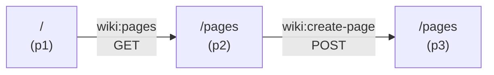

# hal-walk

A CLI tool for exploring HAL APIs through HATEOAS link-following. It records every step as a directed multigraph in a session file, which can be rendered as a diagram or exported as a deterministic path spec.

## The idea

There are two phases to building an API integration:

**Phase 1: Exploration (non-deterministic).** An AI agent navigates an unfamiliar API by following hypermedia links. It reads relation documentation, reasons about what method to use and what data to send, and makes choices about which paths to explore. This is inference-heavy — the agent is building a mental model of the API through progressive disclosure.

**Phase 2: Distillation (deterministic).** Once the agent has completed a workflow — say, creating a wiki page, editing it, and adding a comment — the entire traversal is recorded in the session graph. The `export` command extracts the path as a **declarative spec**: a sequence of steps with exact relations, methods, and input shapes. This spec can be executed by a simple runner with no LLM involved.

The CLI is the bridge between these two phases. It gives the agent a structured way to explore (every action is recorded) and a way to crystallize what it learned into reusable, deterministic code.

### Progressive disclosure for APIs

Traditional API clients need complete knowledge upfront — an OpenAPI spec, a client library, hardcoded URLs. hal-walk takes the opposite approach:

1. `npx hal-walk start` — the agent sees only the root resource and its links
2. `npx hal-walk describe` — the agent reads the documentation for a link relation (a markdown prompt file served by the API)
3. `npx hal-walk follow` — the agent acts on what it learned
4. Repeat — each response reveals new links to explore

The agent never needs a complete map of the API. It discovers capabilities incrementally, just like a human clicking through a website. The difference is that every click is recorded, and the recording can be compiled into a repeatable workflow.

## Installation

```bash
npm install
```

## Usage

All commands output JSON to stdout (except `describe`, which outputs markdown, and `render`, which outputs Mermaid). Errors go to stderr.

### Start a session

```bash
npx hal-walk start -s session.json http://localhost:3000/
```

Fetches the root resource, creates a session file, and stores any CURIE definitions.

### Explore available links

```bash
npx hal-walk position -s session.json
```

Shows the current position, the stored HAL response, and all available link relations.

### Read relation documentation

```bash
npx hal-walk describe -s session.json wiki:create-page
```

Expands the CURIE and fetches the relation's documentation — a markdown file describing the method, input schema, and expected response. This is what the agent reads to figure out how to use a link.

### Follow a link

```bash
# GET (default)
npx hal-walk follow -s session.json wiki:pages

# POST with data (method inferred from --data)
npx hal-walk follow -s session.json wiki:create-page \
  --data '{"title": "My Page", "body": "Content here"}'

# Templated link with variable expansion
npx hal-walk follow -s session.json wiki:version \
  --template-vars '{"vid": "2"}'

# Explicit method override
npx hal-walk follow -s session.json wiki:edit-page \
  --method PUT --data '{"body": "Updated content"}'
```

### Navigate the session graph

```bash
# Jump back to a previous position (local, no HTTP request)
npx hal-walk goto -s session.json p1
```

### Visualize the traversal

```bash
npx hal-walk render -s session.json
```

Outputs a Mermaid diagram of the session graph:



### Export a deterministic path spec

```bash
npx hal-walk export -s session.json
npx hal-walk export -s session.json --from p1 --to p5
```

Extracts the shortest path between two positions and outputs a declarative workflow spec:

```json
{
  "name": "exported-path",
  "baseUrl": "http://localhost:3000",
  "steps": [
    { "id": "step1", "action": "start", "url": "/" },
    { "id": "step2", "action": "follow", "from": "step1", "relation": "wiki:pages", "method": "GET" },
    { "id": "step3", "action": "follow", "from": "step2", "relation": "wiki:create-page", "method": "POST",
      "input": { "data": { "title": "My Page", "body": "Content" } } }
  ]
}
```

This spec contains no ambiguity. A runner reads it and executes each step mechanically — the only hook point is providing input data for steps that need it.

## Session file

The session is a JSON file representing a directed multigraph:

- **Positions** — nodes in the graph, each storing the URL, HTTP method, status code, and full HAL response
- **Transitions** — directed edges labeled with the link relation, method, and any input data
- **CURIEs** — stored from the root response so the CLI can expand `wiki:pages` to its documentation URL throughout the session

The graph structure means the agent can explore branching paths (via `goto` to revisit earlier positions) and the export can find optimal paths through BFS.

## How an agent uses this

An LLM agent operating hal-walk doesn't need prior knowledge of the target API. A typical session:

1. **Start** at the root — see what links are available
2. **Describe** an interesting relation — read the markdown to understand method, input, behavior
3. **Follow** the relation — provide the right data based on what it read
4. **Observe** the response — see new links that weren't visible before
5. **Repeat** until the task is done
6. **Export** the successful path — produce a spec that can run without the agent

The agent's inference is only needed during exploration. The exported artifact is pure data.
